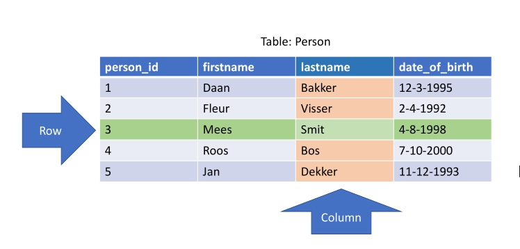

# MYSQL-BASIC

- [MYSQL-BASIC](#mysql-basic)
  - [Uitleg](#uitleg)
    - [Database opbouw](#database-opbouw)
  - [Leerdoelen](#leerdoelen)
  - [Bronnen](#bronnen)

## Uitleg

SQL is een taal die gebruikt wordt voor het manipuleren van gegevens in een database en staat voor Structured Query Language. Een query is een vraag. SQL is dus een taal die jouw als programmeur op een gestructureerde manier vragen laat stellen (aan een database server).

Elk applicatie die je bouwt zal ergens gegevens opslaan, denk hierbij alleen al aan de vele online diensten die allerlei gegevens over de gebruikers opslaan. Bijna altijd gebruikt de applicatie een database op de achtergrond en wordt er gebruik gemaakt van een taal zoals SQL om de gegevens op te slaan of op te halen.  

SQL wordt al gebruikt sinds 1974 en er zijn veel verschillende varianten die gemaakt zijn om een specifieke database aan te spreken (bijvoorbeeld MsSQL, een variant van Microsoft). Wij gebruik de MySQL variant om een MySQL database die wordt meegeleverd met Xampp aan te spreken.

In de basis zijn de dingen die je kan doen met een database te vangen in de onderstaande vier acties ookwel afgekort tot CRUD:  

1. **Create** (nieuwe gegevens toevoegen)
2. **Read** (gegevens ophalen)
3. **Update** (bestaande gegevens aanpassen)
4. **Delete** (gegevens verwijderen)

In deze module leer je de basis van MySQL om gegevens op te halen en te verwijderen.

### Database opbouw

Een database zoals MySQL bestaan uit tabellen met daarin gegevens. Gegevens die bij elkaar horen staan samen in een tabel. 
> Zo zal bijvoorbeeld een `users` tabel de namen en wachtwoorden van de gebruikers van een applicatie bevatten.

Elke tabel is opgebouwd uit kolommen (Columns) en rijen (Rows), net zoals je misschien wel kent van een excel spreadsheet.

>Bovenstaande afbeelding toon een voorbeeld van een tabel genaamd `Person` met daarin de informatie van vijf personen. Elke rij bevat dus informatie die bij één enkele persoon hoort. En elke kolom bevat één soort informatie over een persoon.

Een database bevat vaak meerdere tabellen. Zo zie je in onderstaand voorbeeld een tabel `person` met informatie over personen en een tabel `product` met informatie over producten.

MySQL is een zogenaamde *relationele* database. De tabellen in een MySQL database hebben (bijna altijd) een relatie met elkaar. Zo hoort een product uit de `product` tabel bijvoorbeeld bij een persoon uit de `person` tabel.

Dit relationele gedeelte komt in latere modules terug, voor nu richten wij ons in deze module op het ophalen van gegevens uit een enkele tabel.

## Leerdoelen

1. [ ] Ik kan ..

## Bronnen

